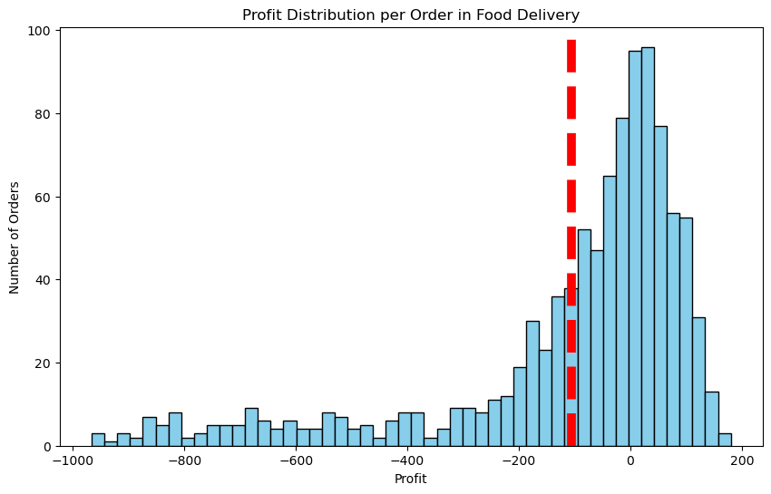
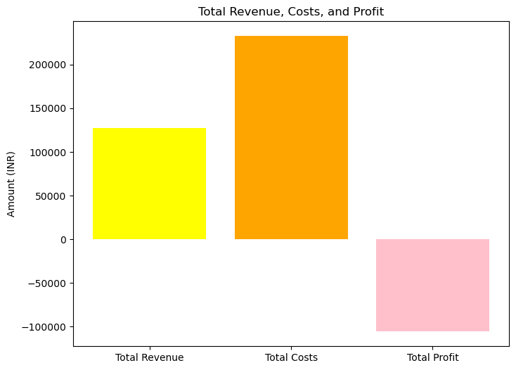

```python
import pandas as pd
from datetime import datetime

food_orders = pd.read_csv(r"C:\Users\priya\Downloads\food_orders_new_delhi.csv")

print(food_orders.head())

```


```python
print(food_orders.info())
```

    <class 'pandas.core.frame.DataFrame'>
    RangeIndex: 1000 entries, 0 to 999
    Data columns (total 12 columns):
     #   Column                  Non-Null Count  Dtype 
    ---  ------                  --------------  ----- 
     0   Order ID                1000 non-null   int64 
     1   Customer ID             1000 non-null   object
     2   Restaurant ID           1000 non-null   object
     3   Order Date and Time     1000 non-null   object
     4   Delivery Date and Time  1000 non-null   object
     5   Order Value             1000 non-null   int64 
     6   Delivery Fee            1000 non-null   int64 
     7   Payment Method          1000 non-null   object
     8   Discounts and Offers    1000 non-null   object
     9   Commission Fee          1000 non-null   int64 
     10  Payment Processing Fee  1000 non-null   int64 
     11  Refunds/Chargebacks     1000 non-null   int64 
    dtypes: int64(6), object(6)
    memory usage: 93.9+ KB
    None
    


```python
# convert date and time columns to datetime
from datetime import datetime

food_orders['Order Date and Time'] = pd.to_datetime(food_orders['Order Date and Time'])
food_orders['Delivery Date and Time'] = pd.to_datetime(food_orders['Delivery Date and Time'])

```


```python
# first, let's create a function to extract numeric values from the 'Discounts and Offers' string
def extract_discount(discount_str):
    if 'off' in discount_str:
        #Fixed amount off
        return float(discount_str.split(' ')[0])
    elif '%' in discount_str:
        #Percentage off
        return float(discount_str.split('%')[0])
    else:
        #No discount
        return 0.0
    
# apply the function to create a new 'Discount Value' column
food_orders['Discount Percentage'] = food_orders['Discounts and Offers'].apply(lambda x: extract_discount(x))

# for percentage discounts, calculate the discount amount based on the order value
food_orders['Discount Amount'] = food_orders.apply(lambda x: (x['Order Value'] * x['Discount Percentage'] / 100)
                                                   if x['Discount Percentage'] > 1
                                                   else x['Discount Percentage'], axis=1)

# adjust 'Discount Amount' for fixed discounts directly specified in the 'Discounts and Offers' column
food_orders['Discount Amount'] = food_orders.apply(lambda x: x['Discount Amount'] if x['Discount Percentage'] <= 1
                                                   else x['Order Value'] * x['Discount Percentage'] / 100, axis=1)

print(food_orders[['Order Value', 'Discounts and Offers', 'Discount Percentage', 'Discount Amount']].head(), food_orders.dtypes)
```

       Order Value Discounts and Offers  Discount Percentage  Discount Amount
    0         1914            5% on App                  5.0            95.70
    1          986                  10%                 10.0            98.60
    2          937         15% New User                 15.0           140.55
    3         1463                 None                  0.0             0.00
    4         1992         50 off Promo                 50.0           996.00 Order ID                              int64
    Customer ID                          object
    Restaurant ID                        object
    Order Date and Time          datetime64[ns]
    Delivery Date and Time       datetime64[ns]
    Order Value                           int64
    Delivery Fee                          int64
    Payment Method                       object
    Discounts and Offers                 object
    Commission Fee                        int64
    Payment Processing Fee                int64
    Refunds/Chargebacks                   int64
    Discount Percentage                 float64
    Discount Amount                     float64
    Total Costs                         float64
    Revenue                               int64
    Profit                              float64
    Simulated Commission Fee            float64
    Simulated Discount Amount           float64
    Simulated Total Costs               float64
    Simulated Profit                    float64
    dtype: object
    


```python
# visualizing the comparison
import seaborn as sns

plt.figure(figsize=(14, 7))

# actual profitability
sns.kdeplot(food_orders['Profit'], label='Actual Profitability', fill=True, alpha=0.5, linewidth=2)

# simulated profitability
sns.kdeplot(food_orders['Simulated Profit'], label='Estimated Profitability with Recommended Rates', fill=True, alpha=0.5, linewidth=2)

plt.title('Comparison of Profitability in Food Delivery: Actual vs. Recommended Discounts and Commissions')
plt.xlabel('Profit')
plt.ylabel('Density')
plt.legend(loc='upper left')
plt.show()
```


```python
# calculate total costs and revenue per order
food_orders['Total Costs']=food_orders['Delivery Fee']+ food_orders['Payment Processing Fee']+food_orders['Discount Amount']
food_orders['Revenue'] =food_orders['Commission Fee']
food_orders['Profit'] = food_orders['Revenue']-food_orders['Total Costs']

# aggregate data to get overall metrics
total_orders=food_orders.shape[0]
total_revenue=food_orders['Revenue'].sum()
total_costs=food_orders['Total Costs'].sum()
total_profit = food_orders['Profit'].sum()

overall_metrics = {
    "Total Orders": total_orders,
    "Total Revenue": total_revenue,
    "Total Costs": total_costs,
    "Total Profit": total_profit
}

print(overall_metrics)
```

    {'Total Orders': 1000, 'Total Revenue': 126990, 'Total Costs': 232709.85, 'Total Profit': -105719.85}
    


```python
import matplotlib.pyplot as plt
# histogram of profits per order
plt.figure(figsize=(10,6))
plt.hist(food_orders['Profit'],bins=50,color='skyblue',edgecolor='black')
plt.title('Profit Distribution per Order in Food Delivery')
plt.xlabel('Profit')
plt.ylabel('Number of Orders')
plt.axvline(food_orders['Profit'].mean(), color='red', linestyle='dashed', linewidth=7)
plt.show()
```


    

    


```python
# pie chart for the proportion of total costs
costs_breakdown = food_orders[['Delivery Fee', 'Payment Processing Fee', 'Discount Amount']].sum()
plt.figure(figsize=(7, 7))
plt.pie(costs_breakdown, labels=costs_breakdown.index, autopct='%1.1f%%', startangle=140, colors=['tomato', 'gold', 'lightblue'])
plt.title('Proportion of Total Costs in Food Delivery')
plt.show()
```


```python
# bar chart for total revenue, costs, and profit

totals = ['Total Revenue', 'Total Costs', 'Total Profit']
values = [total_revenue, total_costs, total_profit]
plt.figure(figsize=(8, 6))
plt.bar(totals, values, color=['yellow', 'orange', 'pink'])
plt.title('Total Revenue, Costs, and Profit')
plt.ylabel('Amount (INR)')
plt.show()

```


    

    


```python
# Filter the dataset for profitable orders
profitable_orders = food_orders[food_orders['Profit'] > 0].copy()  # Ensure you create a copy to avoid SettingWithCopyWarning

# Calculate the average commission percentage for profitable orders
profitable_orders.loc[:, 'Commission Percentage'] = (profitable_orders['Commission Fee'] / profitable_orders['Order Value']) * 100

# Calculate the average discount percentage for profitable orders
profitable_orders.loc[:, 'Effective Discount Percentage'] = (profitable_orders['Discount Amount'] / profitable_orders['Order Value']) * 100

# Calculate the new averages
new_avg_commission_percentage = profitable_orders['Commission Percentage'].mean()
new_avg_discount_percentage = profitable_orders['Effective Discount Percentage'].mean()

print(new_avg_commission_percentage, new_avg_discount_percentage)

```

    30.508436145149435 5.867469879518072
    


```python
# simulate profitability with recommended discounts and commissions
recommended_commission_percentage = 30.0  # 30%
recommended_discount_percentage = 6.0    # 6%

# calculate the simulated commission fee and discount amount using recommended percentages
food_orders['Simulated Commission Fee'] = food_orders['Order Value'] * (recommended_commission_percentage / 100)
food_orders['Simulated Discount Amount'] = food_orders['Order Value'] * (recommended_discount_percentage / 100)

# recalculate total costs and profit with simulated values
food_orders['Simulated Total Costs'] = (food_orders['Delivery Fee'] +
                                        food_orders['Payment Processing Fee'] +
                                        food_orders['Simulated Discount Amount'])

food_orders['Simulated Profit'] = (food_orders['Simulated Commission Fee'] -
                                   food_orders['Simulated Total Costs'])

```

#The visualization compares the distribution of profitability per order using actual discounts and commissions versus the simulated scenario with recommended discounts (6%) and commissions (30%).

The actual profitability distribution shows a mix, with a significant portion of orders resulting in losses (profit < 0) and a broad spread of profit levels for orders. The simulated scenario suggests a shift towards higher profitability per order. The distribution is more skewed towards positive profit, indicating that the recommended adjustments could lead to a higher proportion of profitable orders.
